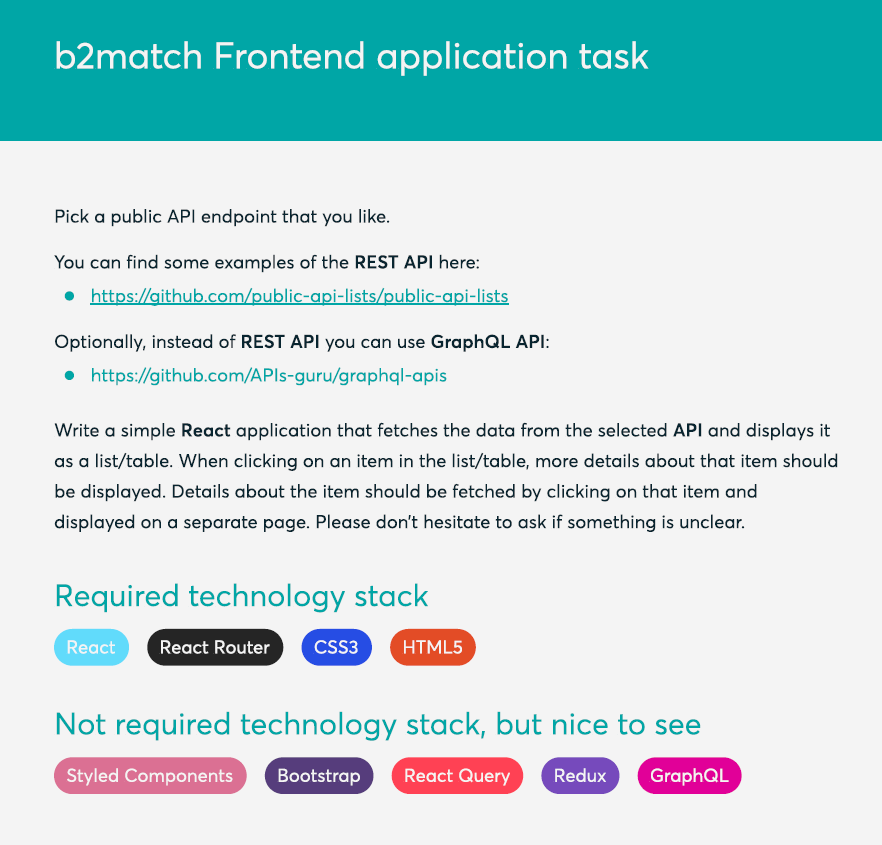

# Fetching ~ Beer API ~ with React

### Task:

 

#### Technology I use:

- Sass
- React Router Dom
- Responsive Design
- Beer API [Link](https://api.punkapi.com/v2/beers)

 

## Available Scripts

In the project directory, you can run:

### `npm install`

### `npm start`

Runs the app in the development mode.\
Open [http://localhost:3000](http://localhost:3000) to view it in your browser.

This project was bootstrapped with [Create React App](https://github.com/facebook/create-react-app).
